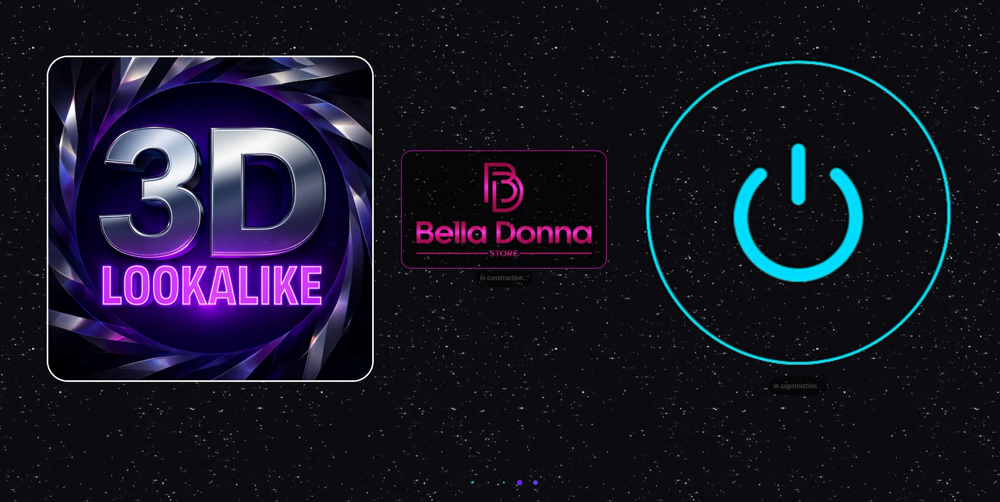

  
</svg>" alt="" />

  

---

### 🚀 **Stacks**

| Front-end | Back-End | Mobile |
| - | - | - |
|                 |                 |                          |

---

### 🏗️ **Arquitetura & Padrões**

  
  
  
  
  
  
  
  
  

---

### ⚡ **Metodologias Ágeis & Ferramentas**

  
  
  

---

### 🗄️ **Databases & Ferramentas**

  
  
  
  
  
  
  
 
 

---

### 🛠️ **Modelagens & Ferramentas**
  
  
  
  
  

---

### 💻**IDEs**

  
  
  
  
  
  

---

### 🔐 **Segurança & Autenticação**

| Autenticação & Tokens | Criptografia & Hashing | Proteções & Boas Práticas |
|----------------------|----------------------|---------------------------|
|    |    |        |

---

### 🛡️ **DevSecOps & Ferramentas**

  
  
  
  
  

---

### 🧪 **Tests & Ferramentas**

  
  
  
  

---

### ☁️ **Plataformas & Infraestrutura**

| Containerização e Orquestração | IaC & Automação | CI/CD & GitOps | Monitoramento, Logs & Tracing | Operações & Infra |
|-------------------------------|----------------|----------------|-------------------------------|-----------------|
|    |  |      |          |      |
|  |  |  |  |  |
|  |  |  |  |  |

---

### 🎨 **UI/UX - Prototipagem & Ferramentas**

| Design & Prototipagem | Ícones | Componentes UI |
|------------------------|--------|----------------|
|        |   |  |

---

### ♿ **Acessibilidade**

     

---

### ⚡ **Cache & Mensageria** 

| Cache | Mensageria |
|-------|------------|
|    |   |

---

### 🔧 **Extras**

  
  
  

---

### 📖 **Documentação & Ferramentas**

| Especificações & APIs | Diagramas & Modelagem | Sites & Projetos |
|------------------------|------------------------|------------------|
|    |    |      |

---
  

  <h3>🏅 Reconhecimentos Acadêmicos - Aluno Nota 10 – Estácio</h3>
  

    Reconhecimento por excelência acadêmica nas disciplinas.
  

  <table>
    <tr>
      <td align="center">
        
      </td>
      <td align="center">
        
      </td>
    </tr>
  </table>

---

  <h3>🐾 Projetos em Destaque</h3>

  <h4>🐶 Adote um Pet</h4>

    

  

    O projeto <strong>"Adote um Pet"</strong> é uma iniciativa de extensão da faculdade Estácio, 
    desenvolvida por Paulo de Tasso.  
    Em parceria com a Vigilância Sanitária de Imaculada-PB, 
    o projeto visa resgatar cães em situação de abandono 
    e disponibilizá-los para adoção no canil público.  
    O objetivo é oferecer um novo lar para esses animais 
    e promover a conscientização sobre a importância da adoção responsável.
  

  

    🔗 <a href="https://github.com/PauloDeTasso/AdoteUmPet" target="_blank">
    Acesse o repositório no GitHub</a>
  

---

### 🌐 Portfólio de Projetos

  
  
Este link reúne <b>alguns dos projetos desenvolvidos por Paulo de Tasso</b>

  🌐 <a href="https://paulodetasso.github.io/projetos/">Visite os projetos online</a>

---

  
  

---

### 🌍 **Conecte-se comigo**

  
  

 

</svg>" alt="" />

